# hello, world!

  

 

I'm Basil, and I build software.

I've spent most of my time moving between web automation and algorithmic trading systems, figuring out how to make things not just work, but work reliably. I use **[PostgreSQL](https://postgresql.org)** a lot, at this point it's just second nature. For deployment, I stick with **[Docker](https://docker.com)** and run everything on **[Ubuntu](https://ubuntu.com)**.

Lately, I've been deep in trading strategy design and AI hackathons, trying to push ideas into something that actually holds up in real use.

I've built things like [AIPE](https://discord.com/oauth2/authorize?client_id=1431460121904418919), a sniper bot that lives inside Discord, and [Quasar](https://quasar-ai-agent.vercel.app), an AI agent I worked on during a Lablab AI hackathon. Alongside that, I run [noblequant](https://www.noblequant.pro/), where I work on algorithmic trading systems, from strategy design to implementation, risk management, and fixing what breaks when systems meet real markets.

I'm open to working on anything around AI automation, algorithmic trading, or web automation and scraping.

<table align="center">
  <tr>
    <td></td>
    <td></td>
  </tr>
  <tr>
    <td colspan="2"></td>
  </tr>
</table>
